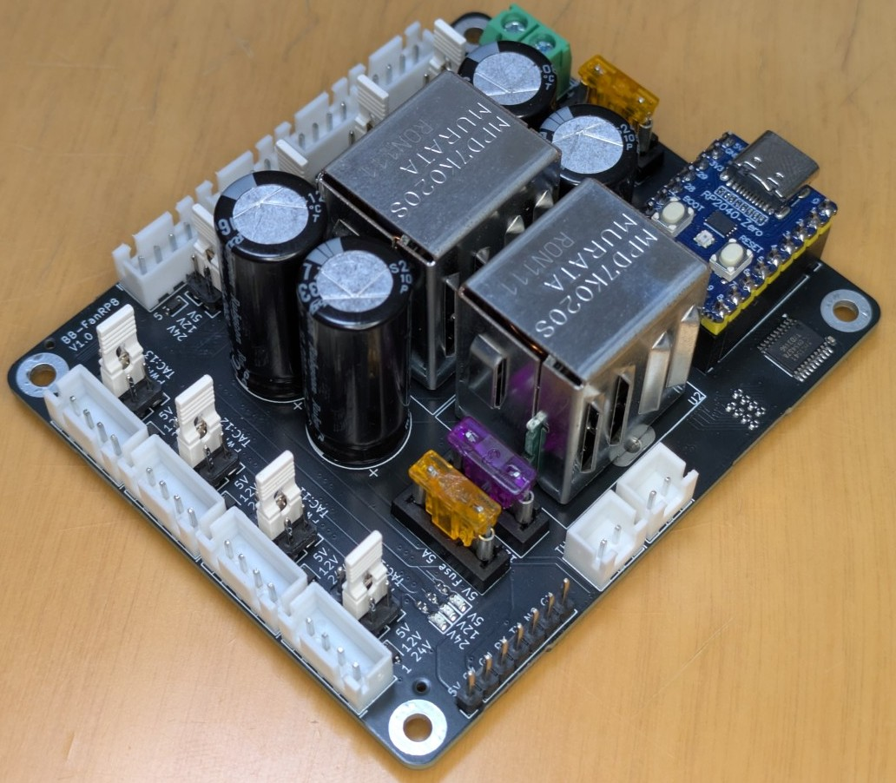

# BB-FanRP8
8 channel fan controller for Klipper



- 4ピンPWMファンコントローラー x 8
- ファン電圧は24V, 12V, 5Vに設定可能
- サーミスタ入力 x 2
- 2つのホスト接続方法
  - Raspberry Pi 40pin GPIO UART
    - 5V電源供給も可能
  - USB Serial
- 5V/5A, 12V/3A DC/DC搭載

> [!IMPORTANT]
> 2線式DCファンの速度制御には対応していません。

# Klipper書き込み
## UART
### 1. Raspberry Piとの接続
Raspberry Piとの接続には付属の7ピンケーブルを用いて接続します。

> [!WARNING]
> 電源の逆接続を防ぐため、ケーブルはねじらず平行に接続してください。

| GPIO | ピン |
|------|------|
| 2  | 5V |
| 4  | 5V |
| 6  | GND |
| 8  | GPIO14 TX |
| 10 | GPIO15 RX |
| 12 | GPIO18 (接続なし) |
| 14 | GND |

### 2. Katapultのインストール(必要な場合)
UART経由でKlipperバイナリを書き込むため、[Katapult](https://github.com/Arksine/katapult)をダウンロードします。
```
cd
git clone https://github.com/Arksine/katapult
```

### 3. Klipperのコンパイル
Klipperのディレクトリに移動し、make環境を初期化してmenuconfigに入ります。
```
cd klipper
rm .config && make clean && make menuconfig
```
menuconfigの設定は以下の通りです。
```
[*] Enable extra low-level configuration options
    Micro-controller Architecture (Raspberry Pi RP2040/RP235x)  --->
    Processor model (rp2040)  --->
    Bootloader offset (16KiB bootloader)  --->
    Communication Interface (UART0 on GPIO0/GPIO1)  --->
(250000) Baud rate for serial port
()  GPIO pins to set at micro-controller startup (NEW)
```
`Q`->`Y`でconfigを保存します。

makeコマンドでコンパイルします。
```
make
```

次のコマンドはRP2040-Zeroボードの`RESET`ボタンを押す準備をしてから実行してください。

通常、GPIO14, 15を用いるUARTでは`ttyAMA0`に割り当てられますが、もし違う場合は適宜コマンドを修正してください。
> [!TIP]
> `-f <klipper.bin path>`オプションによりKlipperのバイナリファイルの場所を指定できます。指定しない場合、`~/klipper/out/klipper.bin`が使用されます。(参考)[Katapult flashtool.pyの使い方](https://github.com/Arksine/katapult?tab=readme-ov-file#flash-tool-usage)
```
sudo service klipper stop && python3 ~/katapult/scripts/flashtool.py -d /dev/ttyAMA0 && sudo service klipper start
```
`Attempting to connect to bootloader`が表示されたら、RP2040-Zeroボードの`RESET`ボタンをダブルクリックします。ダブルクリックによってKatapultブートローダーが起動します。

`Flash Success`と表示が出たら書き込み完了です。

# Katapultブートローダーのコンパイル
通常この手順は必要ありません。Katapultブートローダーを再び書き込みしなければならない場合に実行してください。また、ブートローダーを書き込んだ後はKlipperの書き込みを行う必要があります。

(準備中)
```
    Micro-controller Architecture (Raspberry Pi RP2040/RP235x)  --->
    Processor model (rp2040)  --->
    Flash chip (W25Q080 with CLKDIV 2)  --->
    Build Katapult deployment application (Do not build)  --->
    Communication Interface (UART0 on GPIO0/GPIO1)  --->
(250000) Baud rate for serial port (NEW)
()  GPIO pins to set on bootloader entry
[*] Support bootloader entry on rapid double click of reset button
[ ] Enable bootloader entry on button (or gpio) state
[ ] Enable Status LED
```

# 組み立て
C1, C2: 35V 1000uF ZLH

C3, C4: 16V 3300uF ZLH

XHコネクタ、ヒューズ、ターミナル、C1&C2、DC/DC、C3&C4の順に背が高くなります。